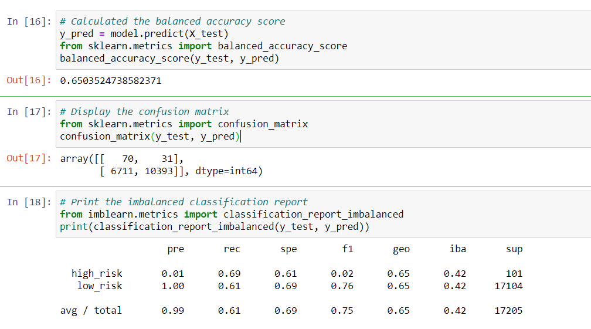
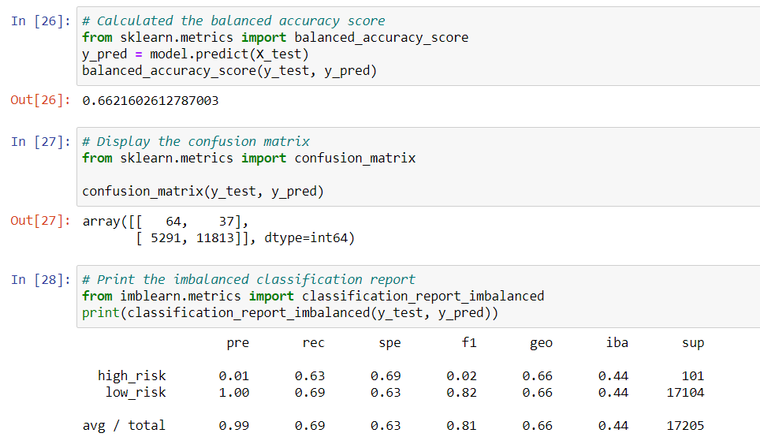
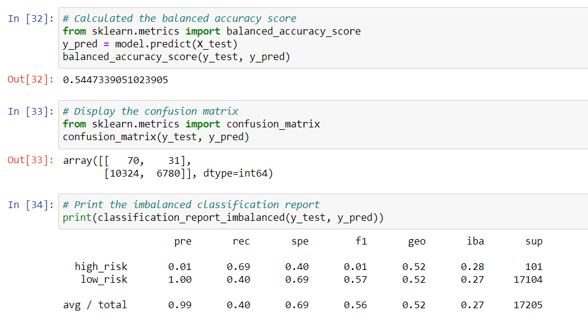
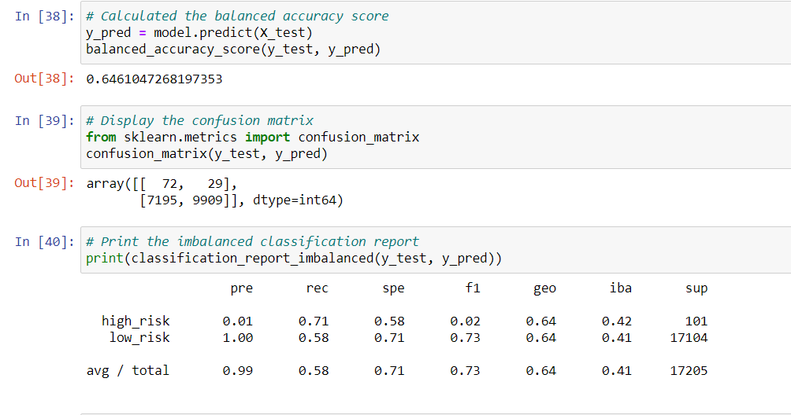
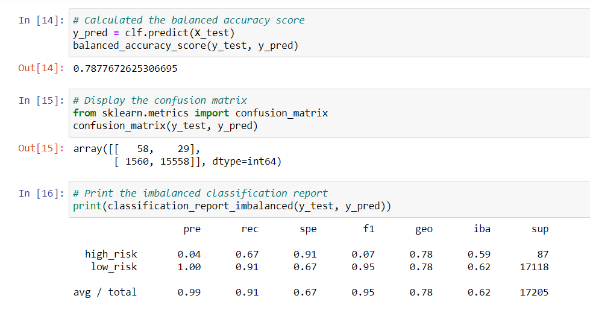
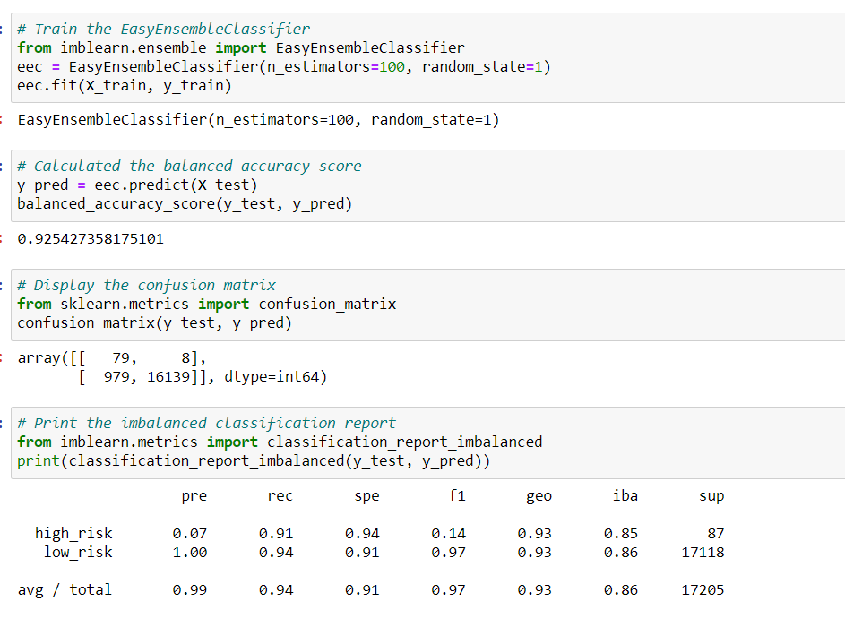

# Supervised Machine Learning and Credit Risk

## Overview of the analysis

- The purpose of this project is to employ different techniques to train and evaluate models with unbalanced classes, in order to assess credit risk. imbalanced-learn and scikit-learn libraries are used to build and evaluate models using resampling.

## Results

- First up is the naive random oversampling. The balance accuracy score is around 65%. The high-risk precision is very low (with only 1%), but the low risk precision is very high (100%) because there are many low-risk samples. 
- 
- Next is the SMOTE oversampling. It turns out to be similar with the results of the naive random sampling, with a balance accuracy of 66%, slightly higher than the naive random sampling. The high-risk precision and the low-risk precision are the exact same with the previous method as well. 
- 
- Next is the cluster centroid model. As an undersampling method, the balance accuracy score goes down to around 54%. High risk precision remains only 1%. Low risk F1 score is lower than the previous two oversampling methods, because the sample is smaller for low-risk.
- 
- The fourth method is SMOTEENN, which is a combination of oversampling and undersampling. While the precision scores for both high-risk and low-risk stay the same (1% and 100% respectively), the F1 score for low-risk (0.73) is higher than the previous method, but lower than the two oversampling methods.
- 
- The fifth method is balanced random forest classfier, which is an ensemble learner instead of a resampling method. This technique does better than all the previous methods, with the precision of high-risk increased to 4%, and the F1 score is increased to 7%. There are way fewer false positive than the previous methods. 
- 
- The last method is easy ensemble AdaBoost classifier. The balance accuracy is the highest amongst all six methods (around 93%), and the precision for both high and low risk is the same as the balanced random classifier. With extremely few false positives, both the sensitivity and the F1 score are very high. 
- 

## Summary

- I would recommend the easy ensemble AdaBoost classifier. While all the methods show low precision for high-risk models, EEA does better than all the resampling methods. It is inevitable to have low precision due to how small the high-risk sample is. There are only 8 false positives, which makes the EEA method stand out amongst all the methods. With so few false positives, the sensitivity is high and the specificity is higher than other methods as well. On top of all these advantages, the balance accuracy score is very high as well (97%). The AdaBoost classifier combines low accuracy models to create a high accuracy model, and it is especially sensitive to outliers. Overall speaking, the bank will benefit the most by using the EEA classifier method. 
